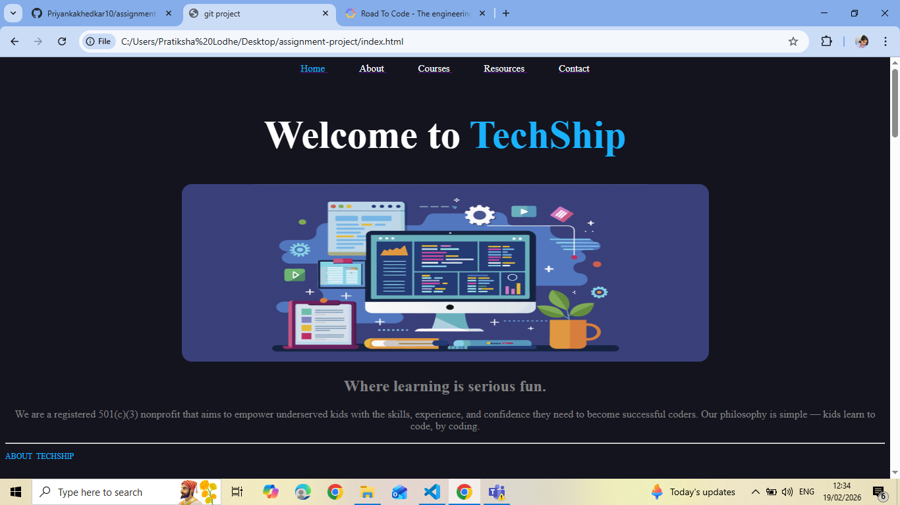

***Hello Welcome to TechShip***

# TECHSHIP

***About TechShip***

- Hands-on coding projects, not just tutorials
- Flexible scheduling for busy families
- Small class sizes for personalized attention
- Expert teachers with industry experience
- Free programs for underserved communities
- Real-world skills that prepare for the future

**TechShip**

Empowering the Next Generation of Coders

Since 2020, TechSpaces has been on a mission to provide high-quality coding education to underserved communities. We believe every child deserves the opportunity to learn the language of the future.

